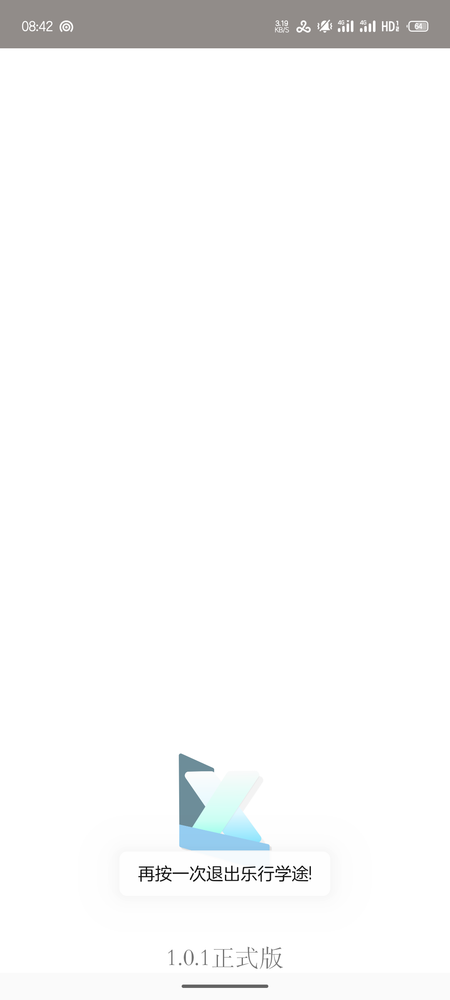
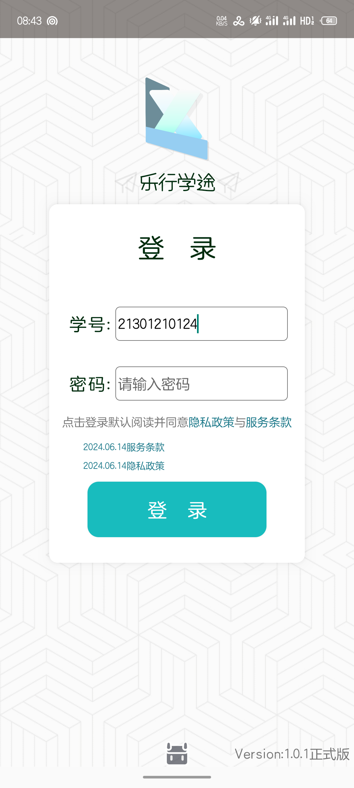
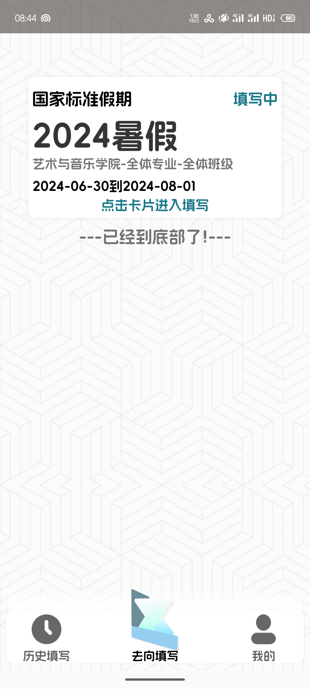
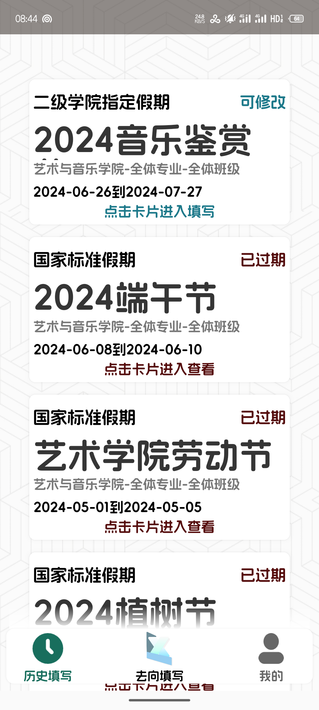
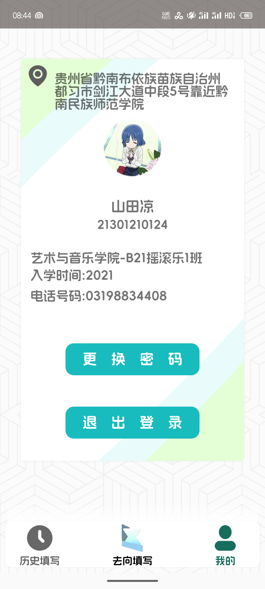
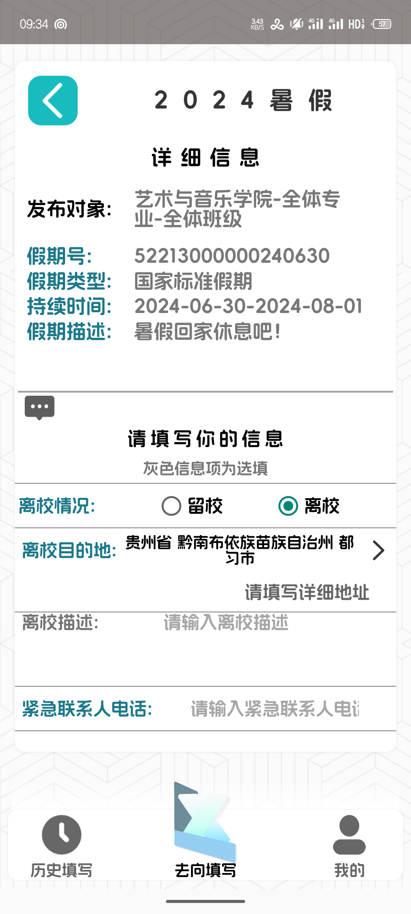
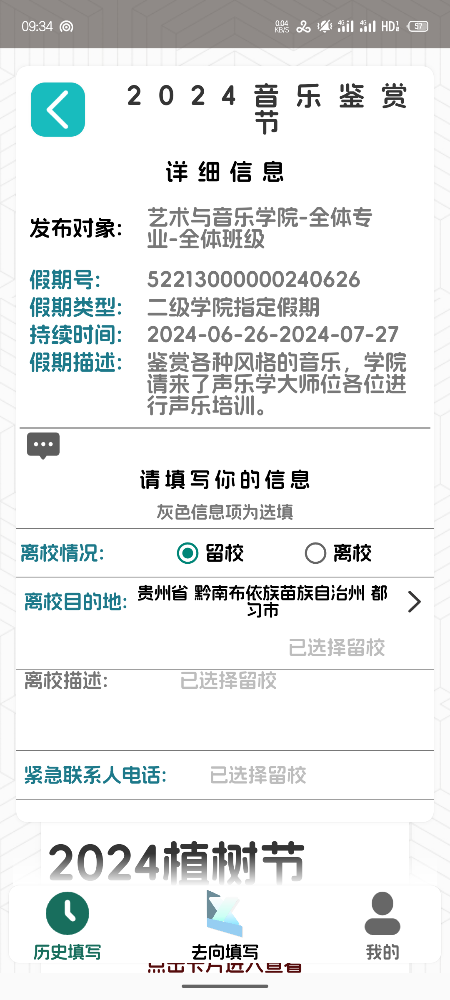
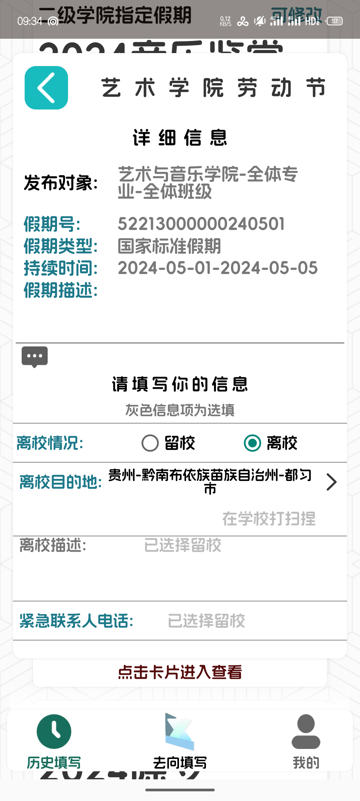

<div align="center">
  <font color="#ffd460">🚧-  “Under maintenance”   -&emsp;<b>维护中</b>&emsp;-  “Under maintenance”    -🚧</font>
</div>

# 乐行学途移动版:<br>

##### [The program is not available in English or other foreign languages, so please use your own translation software to view the program description.]

## 项目目的介绍:<br>
* ### 该项目旨在结合Jakarta后端,为学生提供一个便利的假期去向填写平台,除了填写去向以外,还能够进行表单查看，密码修改

***

## 项目情况介绍:<br>
* ### 该项目是基于我的Jakarta EE开源库Web项目“StudentVentures_Hub”所拓展的一个移动端平台
* ### 该项目必须配合服务器使用，否则无法启动
* ### 该项目使用局域网与Jakarta EE项目的Apache服务器进行交流
* ### 该项目采用MVVM+LiveData+ViewModel进行开发
* ### 该项目目前只在AGP为8.4.0-alpha12的Android Studio平台上运行过
* ### 如果需要降低AGP版本请与我联系：[](mailto:timaviciix@outlook.com)

***

## 项目内容：<br>
### 1.该项目由三个Activity组成，其中包含了一个遮罩Activity,一个登录Activity,一个主页Activity
<div style="display: grid; grid-template-columns: repeat(3, 1fr); gap: 10px;">
        
        
        
</div>

#### 该Activity流设计方式使得遮罩Activity能够实现除第一次外的自动登录模式,通过获取Login_Activity的SharedPreference,遮罩Activity能够快速的获得用户账号与密码,让应用实现自动登录以及保持会话功能.

### 2.该项目中的Main_Activity由一个ViewPager2与MainActivity底部导航栏组成;
<div style="display: grid; grid-template-columns: repeat(3, 1fr); gap: 10px;">
        
        
        
</div>

#### ViewPager2组件中包括了三个Fragment,分别是Main_Fragment,History_Fragment与Profile_Fragment,三个fragment拥有各自的ViewModel供MainActivity进行数据交换与UI交互.

### 3.在填写假期去向时,MainFragment与HistoryFragment会挂载一个子Fragment为用户提供填写UI.
<div style="display: grid; grid-template-columns: repeat(3, 1fr); gap: 10px;">
        
        
        
</div>

#### 这个填写与历史假期查看的Fragment具有良好的防卫式程序设计以及健壮性.

### 4.该项目包含了多个ViewModel,其中每个ViewModel都拥有多个LiveData,其中有很多LiveData提供了消息传递的功能
#### [部分ViewModel存在违反开闭原则的问题，基于时间因素,在不久后我会将其修复]

#### GlobalViewModel
```kotlin
//com.example.vacationventurepe.viewmodels.GlobalViewModel
//AndroidViewModel,全局指定的单例ViewModel

package com.example.vacationventurepe.viewmodels

import android.app.Application
import android.os.Build
import android.util.Log
import androidx.lifecycle.AndroidViewModel
import androidx.lifecycle.LiveData
import androidx.lifecycle.MutableLiveData
import com.example.vacationventurepe.entity.Student
import com.example.vacationventurepe.entity.Venture
import com.example.vacationventurepe.entity.VentureRecord
import java.time.LocalDate
import java.time.format.DateTimeFormatter


class GlobalViewModel(application: Application) : AndroidViewModel(application) {

    private val TAG = javaClass.name

    val studentEntityLiveData: MutableLiveData<Student> = MutableLiveData()

    val sessionIDLiveData: LiveData<String> get() = sessionIDMutableLiveData
    private val sessionIDMutableLiveData: MutableLiveData<String> = MutableLiveData()

    val locationLiveData: LiveData<String> get() = locationMutableLiveData
    private val locationMutableLiveData: MutableLiveData<String> = MutableLiveData()

    val vacationLiveData: LiveData<List<Venture>> get() = vacationMutableLiveData
    private val vacationMutableLiveData: MutableLiveData<List<Venture>> = MutableLiveData()

    //DS:被解构LiveData替代
//    val historyVacationLiveData: LiveData<List<Venture>> get() = historyMutableLiveData
//    private val historyMutableLiveData: MutableLiveData<List<Venture>> = MutableLiveData()

    val historyAndRecordLiveData: LiveData<Pair<List<Venture>, List<VentureRecord>>> get() = historyAndRecordMutableLiveData
    private val historyAndRecordMutableLiveData: MutableLiveData<Pair<List<Venture>, List<VentureRecord>>> =
        MutableLiveData()

    fun postSessionID(id: String) {
//        DEBUG
        if (id != sessionIDMutableLiveData.value) {
            Log.d(TAG, "Global注册会话ID中!")
            sessionIDMutableLiveData.postValue(id)
        }
    }

    fun postLocation(address: String) {
        if (address != locationMutableLiveData.value) {
            locationMutableLiveData.postValue(address)
        }
    }


    fun postVacationList(vacationList: List<Venture>) {

        Log.d(TAG, "假期列表刷新:\n")
        vacationList.forEach {
            Log.d(TAG, "假期号:${it.ventureCode}\n")
        }

        if (Build.VERSION.SDK_INT >= Build.VERSION_CODES.O) {
            val dateFormatter = DateTimeFormatter.ofPattern("yyyy-MM-dd")
            val resultVentures =
                vacationList.sortedByDescending {
                    LocalDate.parse(
                        it.ventureStartDate,
                        dateFormatter
                    )
                }

            vacationMutableLiveData.postValue(resultVentures)
        } else {
            vacationMutableLiveData.postValue(vacationList)
        }


    }

    fun postHistoryVacationAndRecordList(
        vacationList: List<Venture>,
        recordList: List<VentureRecord>
    ) {

        if (Build.VERSION.SDK_INT >= Build.VERSION_CODES.O) {
            val dateFormatter = DateTimeFormatter.ofPattern("yyyy-MM-dd")
            val resultVacations =
                vacationList.sortedByDescending {
                    LocalDate.parse(
                        it.ventureStartDate,
                        dateFormatter
                    )
                }

            historyAndRecordMutableLiveData.postValue(Pair(resultVacations, recordList))
        } else {
            historyAndRecordMutableLiveData.postValue(Pair(vacationList, recordList))
        }


    }
}

```

#### RequestInfoWriteFragmentViewModel
```kotlin
//com.example.vacationventurepe.viewmodels.mainactivity.RequestInfoWriteFragmentViewModel
//为填写Fragment编写的ViewModel
package com.example.vacationventurepe.viewmodels.mainactivity

import androidx.lifecycle.MutableLiveData
import androidx.lifecycle.ViewModel

class RequestInfoWriteFragmentViewModel : ViewModel() {

    var backEventLiveData: MutableLiveData<Boolean> = MutableLiveData()

    var locationChooseLiveData: MutableLiveData<Boolean> = MutableLiveData()
    var locationBackParamsLiveData: MutableLiveData<String> = MutableLiveData()

    var submitStatusliveData:MutableLiveData<String> = MutableLiveData()

}
```

### 5.采用Retrofit进行仓库式的网络请求
#### 该项目采用了Retrofit进行网络请求与交互,通过编写请求API,我们能灵活的在某IP或域名内进行命名空间以及参数切换

#### ServerRetrofitAPI
```kotlin
//com.example.vacationventurepe.network.api.ServerRetrofitAPI
package com.example.vacationventurepe.network.api

import com.example.vacationventurepe.basetools.Base
import com.example.vacationventurepe.basetools.PB
import retrofit2.Call
import retrofit2.http.Field
import retrofit2.http.FormUrlEncoded
import retrofit2.http.GET
import retrofit2.http.POST
import retrofit2.http.Path

interface ServerRetrofitAPI {

    @POST(Base.BASE_HTTP_NAMESPACE)
    fun serverParentConnection(): Call<String>

    @FormUrlEncoded
    @POST(Base.BASE_HTTP_NAMESPACE)
    fun login(
        @Field(PB.A_ACTION) type: String,
        @Field(PB.G_LOGIN_ACCOUNT) account: String,
        @Field(PB.G_LOGIN_PASSWORD) password: String
    ): Call<String>

    @GET("android/{fileName}")
    fun fetchHTML(@Path("fileName") fileName: String): Call<String>

    @FormUrlEncoded
    @POST(Base.BASE_HTTP_NAMESPACE)
    fun resetPassword(
        @Field(PB.S_SESSION) sessionID: String,
        @Field(PB.A_ACTION) action: String,
        @Field(PB.G_LOGIN_ACCOUNT) studentID: String,
        @Field(PB.G_LOGIN_PASSWORD) originPsw: String,
        @Field(PB.RS_NEW_PASSWORD) newPsw: String
    ): Call<String>

    //DS:登录后操作
    @FormUrlEncoded
    @POST(Base.BASE_HTTP_NAMESPACE)
    fun queryVacationList(
        @Field(PB.S_SESSION) sessionID: String,
        @Field(PB.A_ACTION) action: String,
        @Field(PB.QUERY_TYPE) queryType: String,
        @Field(PB.G_LOGIN_ACCOUNT) studentID: String,
        @Field(PB.G_STUDENT_CLASS_CODE) studentCode: String
    ): Call<String>

    @FormUrlEncoded
    @POST(Base.BASE_HTTP_NAMESPACE)
    fun recordOperation(
        @Field(PB.S_SESSION) sessionID:String,
        @Field(PB.A_ACTION) action: String,
        @Field(PB.RECORD_TYPE) recordType:String,
        @Field(PB.RECORD_JSON) recordJSON:String
    ):Call<String>

}
```
#### 灵活的组合以及逻辑处理,使得Retrofit能够良好的与我的APP契合
ServerFetcher
```kotlin
//com.example.vacationventurepe.network.fetchers.ServerFetcher
fun passwordChange(
    sessionID: String,
    studentCode: String,
    originPassword: String,
    newPassword: String
): MutableLiveData<String> {

    val responseLiveData: MutableLiveData<String> = MutableLiveData()

    serverRetrofitAPI
        .resetPassword(sessionID, PB.A_RESET_PSW, studentCode, originPassword, newPassword)
        .enqueue(object : Callback<String> {
            override fun onResponse(call: Call<String>, response: Response<String>) {
                responseLiveData.postValue(
                    if (response.body().toString() != "") {
                        JsonParser.parseString(response.body()).asJsonObject.get(PB.R_STATUS).asString
                    } else {
                        ""
                    }
                )
            }

            override fun onFailure(call: Call<String>, t: Throwable) {
                responseLiveData.postValue(Base.NETWORK_ON_FAILURE.toString())
            }
        })

    return responseLiveData
}
```

***

## 第三方API的应用
### 该项目采用了多个第三方API以及官方AAR
```kotlin
//build.gradle.kts
 implementation("androidx.cardview:cardview:1.0.0+")
    implementation(libs.androidx.core.ktx)
    implementation(libs.androidx.appcompat)

    implementation(libs.androidx.lifecycle.livedata.ktx)
    implementation(libs.androidx.lifecycle.viewmodel.ktx)


    implementation(libs.androidx.navigation.fragment.ktx)
    implementation(libs.androidx.navigation.ui.ktx)

    implementation(libs.material)

    //城市选择器
    implementation("com.github.crazyandcoder:citypicker:6.0.2")

    //Retrofit仓库化HTTP服务框架
    implementation("com.squareup.retrofit2:retrofit:2.5.0")
    implementation("com.squareup.retrofit2:converter-scalars:2.5.0")
    implementation("com.squareup.okhttp3:logging-interceptor:4.9.0")

    //GSON数据转换与反射框架
    implementation("com.google.code.gson:gson:2.8.9")

    //Glide基于REST模式的图片部署API
    implementation("com.github.bumptech.glide:glide:4.12.0")

    annotationProcessor("com.github.bumptech.glide:compiler:4.12.0")
    implementation("org.jsoup:jsoup:1.14.2")

    //高德地图提供的逆地理编码解析服务
    implementation(fileTree(mapOf(
        "dir" to "libs",
        "include" to listOf("*.aar", "*.jar"),
        "exclude" to listOf("")
    )))

    //附加：简单的权限请求
    implementation("pub.devrel:easypermissions:3.0.0")

    //刷新头-SmartRefresh
    implementation  ("io.github.scwang90:refresh-layout-kernel:2.1.0")      //核心必须依赖
    implementation  ("io.github.scwang90:refresh-header-classics:2.1.0")    //经典刷新头
    implementation  ("io.github.scwang90:refresh-header-radar:2.1.0" )      //雷达刷新头

    testImplementation(libs.junit)
    androidTestImplementation(libs.androidx.junit)
    androidTestImplementation(libs.androidx.espresso.core)
```

***

## -TIPS-📝使用注意事项📝-TIPS-

#### 该项目采用了高德地图开放平台API,请在使用定位功能时,将API_KEY更改或者更换第三方定位以及逆地理编码服务
#### Base
```kotlin
//com.example.vacationventurepe.basetools.Base
//AMapKey
        const val AMAP_KEY = "<YOUR API KEY>"
```

***

## 📮写在后面📮

* #### 该项目是以学习为目的进行开发的,所以可能运用了在生产环境中比较不稳定的插件以及构件.
* #### 该项目中所运用的所有API皆为开源API
* #### 该项目没有进行过系统性的软件测试,如果非必要,请勿将该项目打包为APK并安装至物理机
* #### Jakarta EE后端正在进行代码整理中,不久后将会开源
***

### 项目运用到的开源API:

[](https://github.com/crazyandcoder/citypicker)
[](https://square.github.io/retrofit/)
[](https://github.com/square/okhttp)
[](https://google.github.io/gson/)
[](https://github.com/bumptech/glide)
[](https://github.com/jhy/jsoup)
[](https://lbs.amap.com/)
<br>
[](https://github.com/googlesamples/easypermissions)
[](https://github.com/scwang90/SmartRefreshLayout)

### 2024.6.26<br>Timaviciix

<div align="center">
  
</div>